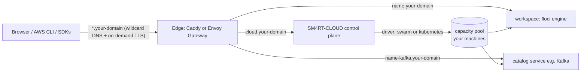

# SM4RT-CLOUD

**Your own cloud, on your own machines.** SM4RT-CLOUD is a self-hosted control
plane that turns any set of Linux boxes — bare metal, VMs or a Kubernetes
cluster — into a multi-tenant personal cloud with an AWS-compatible API and a
catalog of real Apache-family services. Think Coolify × Vercel, but the thing
being served is *cloud capacity itself*.

- **AWS-compatible workspaces** — each workspace is a real
  [floci](https://github.com/mbergo/floci) engine with its own public endpoint.
  Point the AWS CLI, any AWS SDK or Terraform at it: S3, DynamoDB, SQS, SNS,
  Lambda, EC2, Secrets Manager and 100+ other APIs just work.
- **Real service catalog** — 21 one-click services (Kafka, Cassandra, Pulsar,
  Flink, Solr, NiFi, Airflow, Trino, Iceberg, CouchDB, ZooKeeper, ActiveMQ,
  Ozone, Tomcat, httpd, Jupyter, MLflow, Ollama, LGTM observability, …). No
  mocks — every service is the real container, clustered on your capacity.
- **Capacity model** — machines you add to the cluster are *capacity*, not
  pets. Tenants create workspaces; workspaces consume capacity from the pool.
  Add a machine, the pool grows. That's it.
- **30-minute install** — one wizard script for the main machine, one command
  per extra machine, or a Helm chart for Kubernetes.

## How it fits together



One wildcard DNS record (`*.your-domain → main machine IP`) is all the DNS you
ever configure. New workspaces and services get subdomains instantly; TLS certs
are issued on demand via Let's Encrypt.

## Install

### Option A — machines (bare metal / VMs, Ubuntu)

Main machine:

```bash
curl -fsSL https://raw.githubusercontent.com/mbergo/sm4rt-cloud/main/install/install.sh | sudo bash
```

The wizard asks for domain, Let's Encrypt email, admin credentials and images,
then installs Docker, initializes the cluster, starts the edge proxy and the
console. At the end it prints the console URL, admin URL and access token.

Add capacity (from the main machine, with SSH access to the others):

```bash
./install/add-node.sh ubuntu@10.0.0.12 ubuntu@10.0.0.13 ubuntu@10.0.0.14
```

Non-interactive / private registry:

```bash
sudo INSTANCE_DOMAIN=cloud.example.com ACME_EMAIL=you@example.com \
     REGISTRY_USER=you REGISTRY_PASS=ghp_xxx bash install.sh
```

### Option B — Kubernetes (Helm)

```bash
./install/install-k8s.sh            # wizard around:
helm upgrade --install sm4rt-cloud charts/floci-cloud \
  --set domain=cloud.example.com --set routing.mode=ingress
```

Full walkthrough (including a 4-machine demo runbook): see
[INSTALL.md](INSTALL.md).

## Console & admin

- **Console** (`cloud.<domain>`) — tenants create workspaces, watch a live
  provisioning terminal (SSE), then get endpoint + credentials + a copy-paste
  `aws` one-liner. Per-workspace views: 20+ AWS service consoles, API explorer,
  catalog services, logs.
- **Admin** (`cloud.<domain>/admin`, HTTP Basic) — real capacity per node
  (CPU/mem), every tenant's workspaces, TTL reaper status, and the exact
  join command for adding machines.
- **Auth modes** — `clerk` (SaaS), `token` (self-hosted default) or `open`,
  selected automatically from runtime config.

## API

All `/api` routes take `Authorization: Bearer <token>` (or Clerk JWT). SSE
endpoints also accept `?access_token=`.

| Method | Path | Description |
|---|---|---|
| GET | `/api/instances` | List workspaces |
| POST | `/api/instances` | Create (`{name?, ttlHours?, services?}`) |
| GET | `/api/instances/:name` | Detail + health |
| DELETE | `/api/instances/:name` | Delete |
| GET | `/api/instances/:name/events` | **SSE** provisioning terminal |
| GET | `/api/instances/:name/logs?tail=` | Engine logs |
| GET/POST/DELETE | `/api/instances/:name/resources/:service[/:id]` | Resource console (s3, sqs, sns, dynamodb, ec2, secrets, …) |
| GET/POST/DELETE | `/api/instances/:name/services[/:id]` | Catalog services |
| GET | `/api/admin/overview` | Nodes + capacity + all workspaces *(Basic auth)* |
| GET | `/api/admin/join-command` | Cluster join command *(Basic auth)* |
| GET | `/api/public/config` | Runtime config (driver, domain, auth mode) |

Workspaces speak AWS:

```bash
export AWS_ACCESS_KEY_ID=test AWS_SECRET_ACCESS_KEY=test
aws --endpoint-url https://demo.cloud.example.com s3 mb s3://data
aws --endpoint-url https://demo.cloud.example.com dynamodb list-tables
```

## Configuration

| Env var | Default | Purpose |
|---|---|---|
| `DRIVER` | `kubernetes` | Capacity driver: `kubernetes` or `swarm` |
| `INSTANCE_DOMAIN` | `floci.sm4rt.works` | Wildcard domain for workspace endpoints |
| `CONSOLE_HOST` | `cloud.<domain>` | Console hostname |
| `FLOCI_CLOUD_TOKEN` | _(unset = open)_ | Console/API bearer token |
| `ADMIN_USER` / `ADMIN_PASS` | `admin` / `floci-admin` | Admin area (Basic auth) |
| `FLOCI_IMAGE` | `floci/floci:latest` | Engine image |
| `INSTANCE_TLS` | `false` | HTTPS for workspace endpoints |
| `ACME_EMAIL` | _(unset)_ | Let's Encrypt account (swarm/Caddy) |
| `CADDY_ADMIN_URL` | _(unset)_ | Caddy admin API (swarm edge) |
| `REGISTRY_USER/PASS/SERVER` | _(unset)_ / `ghcr.io` | Pull private images on all nodes (swarm) |
| `INGRESS_CLASS` | `nginx` | k8s ingress mode |
| `GATEWAY_NAME` / `GATEWAY_NAMESPACE` | _(unset)_ | k8s Gateway API mode (Envoy) |
| `CLUSTER_ISSUER` | `letsencrypt` | cert-manager issuer (k8s) |
| `CLERK_SECRET_KEY` / `CLERK_PUBLISHABLE_KEY` | _(unset)_ | Enable Clerk auth |
| `MAX_INSTANCES` | `20` | Workspace cap |
| `MAX_TTL_HOURS` | `168` | Max workspace TTL |

## Repository layout

```
api/        Fastify control plane (drivers: swarm.ts, k8s.ts; edge: caddy.ts;
            catalog: services.ts; SSE bus: events.ts)
ui/         React 19 + Vite + Tailwind 4 console (+ /admin)
install/    install.sh · add-node.sh · install-k8s.sh
charts/     Helm chart
deploy/     Reference AKS manifests (SaaS)
INSTALL.md  Step-by-step install & demo guide
```

## Development

```bash
make install   # npm install api + ui
make dev-api   # API on :8080 (uses your kubeconfig or local docker)
make dev-ui    # Vite dev server proxying /api
make build     # production UI bundle
```

Images are published to `ghcr.io/mbergo/sm4rt-cloud` (control plane) and
`ghcr.io/mbergo/floci` (engine) by CI.

## Naming

The product is **SM4RT-CLOUD**; **floci** is the AWS-compatible engine that
powers workspaces. Internal identifiers (service names, labels, env vars,
`floci-i-*` namespaces) keep the `floci` prefix for compatibility.

## Notes

- PoC posture: convenience over hardening. Keep the cluster on a trusted
  network; put real DNS + TLS in front (the installers do this for you).
- Workspace TTLs (1h–7d or never) are enforced by a reaper loop.
- Everything is real: no mocked services, no fake data. If it shows in the
  console, it's running on your capacity.
