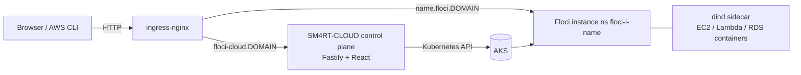

# SM4RT-CLOUD

A self-hosted control plane and dashboard for on-demand [Floci](https://floci.io) AWS
instances, running on your own AKS cluster.

Each instance is an isolated Floci deployment with its own public endpoint — point the AWS CLI,
any AWS SDK or Terraform at it and start creating buckets, queues, tables, servers and secrets.
You can also manage resources straight from the dashboard.

## Architecture



- **API** (`api/`) — Node 24 + Fastify. Provisions one namespace per instance
  (`floci-i-<name>`) containing a Floci deployment, a `docker:dind` sidecar (so Docker-backed
  services such as EC2 work on containerd nodes), a service and an ingress. Also proxies
  resource management (S3, SQS, SNS, DynamoDB, EC2, Secrets Manager) to each instance using
  the AWS SDK.
- **UI** (`ui/`) — React 19 + Vite + Tailwind 4 dashboard: create/delete instances, live
  status, connection snippets (CLI / env / boto3), per-instance resource console and logs.
- **Deploy** (`deploy/`) — namespace-scoped Deployment with a ClusterRole limited to the
  resources the provisioner manages.

## Quick start

Prerequisites: `kubectl` context pointing at your cluster, `docker`, `az` CLI, an ingress
controller with a public IP and a container registry.

```bash
make install        # npm install for api and ui
make build          # build the UI bundle
make image push     # build and push the container image
make deploy         # namespace, secrets, RBAC, deployment, ingress
make url token      # dashboard URL and access token
```

Local development:

```bash
make dev-api        # API on :8080 using your kubeconfig
make dev-ui         # Vite dev server proxying /api
```

## API

All `/api` routes require `Authorization: Bearer <token>`.

| Method | Path | Description |
|---|---|---|
| GET | `/api/instances` | List instances |
| POST | `/api/instances` | Create (`{name?, ttlHours?}`) |
| GET | `/api/instances/:name` | Detail + health |
| DELETE | `/api/instances/:name` | Delete |
| GET | `/api/instances/:name/logs?tail=` | Instance logs |
| GET | `/api/instances/:name/resources/:service` | List resources (`s3`, `sqs`, `sns`, `dynamodb`, `ec2`, `secrets`) |
| POST | `/api/instances/:name/resources/:service` | Create resource (`{name, value?}`) |
| DELETE | `/api/instances/:name/resources/:service/:id` | Delete resource |

Instances accept standard AWS tooling:

```bash
aws --endpoint-url https://<name>.floci.sm4rt.works s3 mb s3://demo
aws --endpoint-url https://<name>.floci.sm4rt.works dynamodb list-tables
```

## Configuration

| Env var | Default | Purpose |
|---|---|---|
| `FLOCI_CLOUD_TOKEN` | _(unset = open)_ | Bearer token for the API/dashboard |
| `INSTANCE_DOMAIN` | `floci.sm4rt.works` | Wildcard domain for instance endpoints |
| `FLOCI_IMAGE` | `floci/floci:latest` | Floci image |
| `INGRESS_CLASS` | `nginx` | Ingress class for instances |
| `INSTANCE_TLS` | `false` | Issue Let's Encrypt certs per instance (`true` in AKS deploy) |
| `CLUSTER_ISSUER` | `letsencrypt` | cert-manager ClusterIssuer used when TLS is on |
| `MAX_INSTANCES` | `20` | Instance cap |
| `PORT` | `8080` | API port |

To use a custom domain, create an A record for the dashboard host and a wildcard A record
(`*.floci.yourdomain.com`) pointing at the ingress public IP, then set `INSTANCE_DOMAIN` and
the ingress host in `deploy/floci-cloud.yaml`.

## Notes

- Instances run with a privileged dind sidecar; keep the cluster private to trusted users.
- TTLs (1h–7d or never) are enforced by a reaper loop that deletes expired namespaces.
- Traffic is plain HTTP by default; put real DNS + cert-manager in front for TLS.
